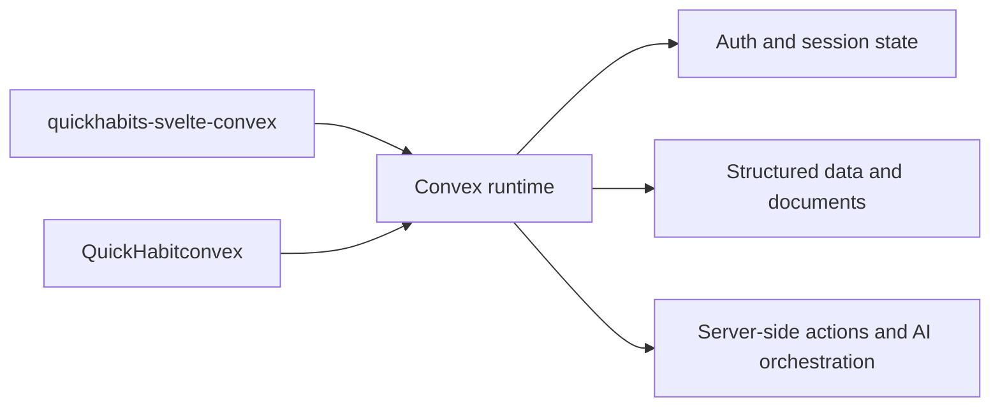

# Runtime Architecture

The Convex lane is a hosted runtime with multiple client surfaces reading from and writing to the same service contract.

## Core flow

## Design rules

- The Convex runtime is the source of truth for authentication, persistence, and server-side behavior.
- Web and native clients may render different experiences, but they should rely on the same backend assumptions.
- Function names, schema changes, and origin assumptions must stay synchronized across every client surface.

## Change hotspots

- Auth or redirect updates usually require web and native verification.
- Schema changes should be reviewed for every client flow that reads or writes the affected records.
- Server-side actions should be documented in terms of their contract and side effects, not only their implementation.
